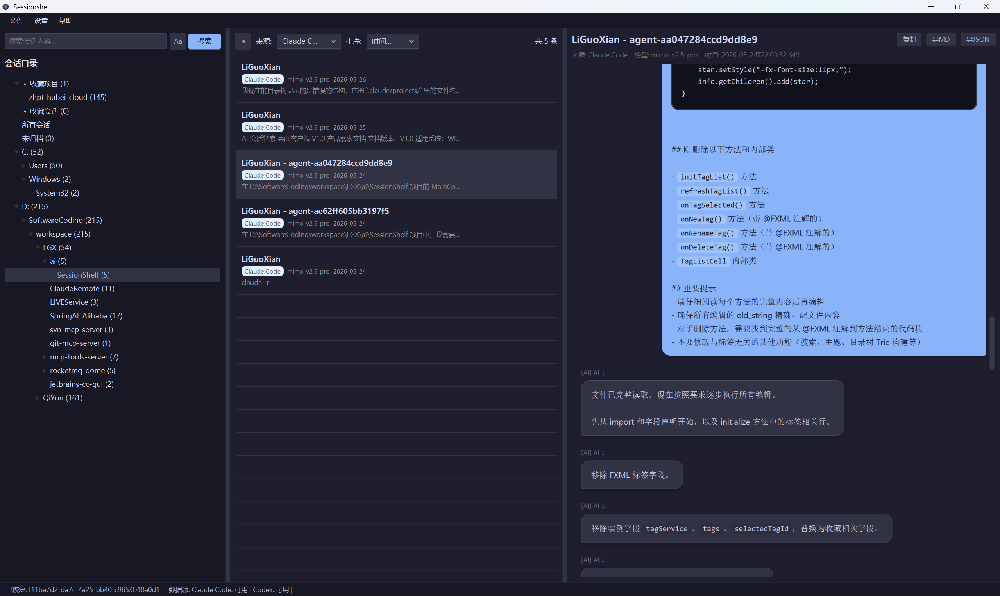
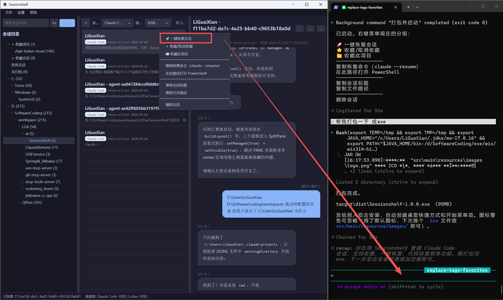

# CC SessionShelf

## 解决了什么痛点

- 会话数据分散 - 不同项目的会话存储在不同位置和格式
- 缺乏统一管理 - 无法跨工具搜索和归类会话
- 数据导出困难 - 会话数据被锁定在各自的工具中
- 寻找与恢复claude code 历史对话困难

SessionShelf的解决方案：
- ✅ 快速跳转：关键词查询 ,右键一键 跳转至Claude Code的历史会话
- ✅ 多源聚合：统一读取 Claude Code的会话数据
- ✅ 目录管理：多级文件夹树形结构，自定义分类整理
- ✅ 标签系统：为会话添加标签，快速筛选定位
- ✅ 全文搜索：跨工具搜索会话标题和内容
- ✅ 便捷导出：支持 Markdown 和 JSON 格式导出
- ✅ 本地离线：纯本地运行，数据不外泄





## 快速启动

### 方式 1: 双击批处理文件（推荐）

直接双击以下任一文件启动：

- **`启动应用.bat`** - 显示控制台日志，方便调试
- **`SessionShelf.bat`** - 无控制台窗口，后台静默运行

### 方式 2: 命令行启动

```bash
cd D:\SoftwareCoding\workspace\LGX\ai\SessionShelf
export JAVA_HOME="C:\Users\LiGuoXian\.jdks\ms-17.0.16"
mvn javafx:run
```


## 功能特性

- **多源会话聚合**: 支持 Claude Code、OpenAI Codex、CC Switch 三款 AI 工具的会话读取
- **目录分组管理**: 多级文件夹树形结构，支持自定义分类
- **标签管理**: 为会话添加自定义标签，方便筛选
- **全文搜索**: 支持标题和内容的全文检索
- **会话导出**: 支持 Markdown 和 JSON 格式导出
- **本地离线**: 纯本地运行，数据不外泄

## 技术栈

- Java 17
- JavaFX 17
- SQLite
- Gson

## 环境要求

- JDK 17 或更高版本
- Maven 3.6+

## 快速开始

### 1. 配置 JDK 17

设置环境变量或在运行时指定：

```bash
export JAVA_HOME=/path/to/jdk-17
```

### 2. 编译项目

```bash
mvn clean compile
```

### 3. 运行应用

```bash
mvn javafx:run
```

## 项目结构

```
SessionShelf/
├── pom.xml
├── src/
│   └── main/
│       ├── java/
│       │   └── com/sessionshelf/
│       │       ├── App.java              # 主应用入口
│       │       ├── Launcher.java         # 启动器
│       │       ├── model/                # 数据模型
│       │       ├── dao/                  # 数据访问层
│       │       ├── service/              # 业务服务层
│       │       ├── parser/               # 数据解析器
│       │       ├── controller/           # UI 控制器
│       │       ├── util/                 # 工具类
│       │       └── config/               # 配置管理
│       └── resources/
│           ├── fxml/                     # FXML 布局
│           └── css/                      # 样式文件
```

## 数据存储

- **应用数据**: `用户目录/SessionShelf/session_shelf.db` (SQLite)
- **配置文件**: `用户目录/SessionShelf/config.properties`

## 数据源路径

| 工具 | Windows 路径 | macOS 路径 |
|------|-------------|-----------|
| Claude Code | `%USERPROFILE%\.claude\projects\` | `~/.claude/projects/` |
| OpenAI Codex | `%USERPROFILE%\.codex\state_5.sqlite` | `~/.codex/state_5.sqlite` |
| CC Switch | 需在设置中配置 | 需在设置中配置 |

## 使用说明

1. **启动同步**: 点击菜单"文件 -> 刷新同步"或工具栏刷新按钮
2. **创建文件夹**: 右键左侧目录树 -> 新建子文件夹
3. **创建标签**: 在左下角输入标签名称，点击"添加"
4. **搜索会话**: 在顶部搜索框输入关键词，点击搜索
5. **导出会话**: 选中会话后，点击右侧"导出 MD"或"导出 JSON"

## 许可证

MIT License
